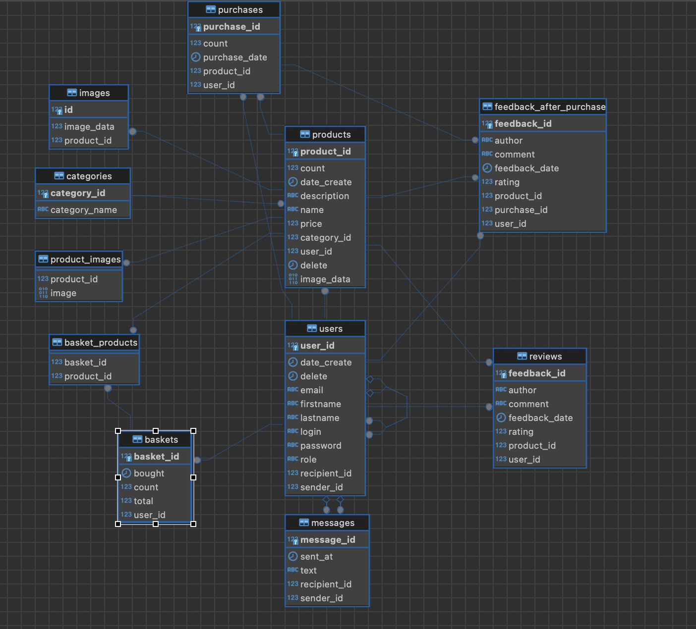

-----Краткая инструкция по моделям и их связям в проекте-----

Модель User

Таблица: `users`
Колонки:
user_id: ID пользователя (Primary Key)
firstname: Имя пользователя
lastname: Фамилия пользователя
role: Роль пользователя
login: Логин пользователя
password: Пароль пользователя
email: Электронная почта пользователя
delete: Время удаления (если применимо)
date_create: Дата создания записи
Связи:
One-to-Many: с Product (пользователь может иметь много продуктов)
One-to-Many: с Basket (пользователь может иметь много корзин)
One-to-Many: с Message (пользователь может быть отправителем многих сообщений)
One-to-Many: с Message (пользователь может быть получателем многих сообщений)

Модель Product

Таблица: `products`
Колонки:
product_id: ID продукта (Primary Key)
name: Название продукта
description: Описание продукта
price: Цена продукта
count: Количество продукта на складе
date_create: Дата создания записи
delete: Время удаления (если применимо)
Связи:
Many-to-One: с Category (много продуктов могут принадлежать одной категории)
Many-to-One: с User (много продуктов могут принадлежать одному пользователю)
One-to-Many: с Purchase (продукт может быть в многих покупках)
One-to-Many: с FeedbackAfterPurchase (продукт может иметь много отзывов после покупки)
One-to-Many: с Reviews (продукт может иметь много отзывов)
Many-to-Many: с Basket (продукт может находиться в многих корзинах)

Модель Basket

Таблица: `baskets`
Колонки:
basket_id: ID корзины (Primary Key)
bought: Время покупки
count: Количество товаров в корзине
total: Общая стоимость товаров в корзине
Связи:
Many-to-One: с User (много корзин могут принадлежать одному пользователю)
Many-to-Many: с Product (корзина может содержать много продуктов)

Модель Purchase

Таблица: `purchases`
Колонки:
purchase_id: ID покупки (Primary Key)
count: Количество купленных товаров
purchaseDate: Дата покупки
Связи:
Many-to-One: с User (много покупок могут принадлежать одному пользователю)
Many-to-One: с Product (много покупок могут быть связаны с одним продуктом)
One-to-Many: с FeedbackAfterPurchase (покупка может иметь много отзывов после покупки)

Модель Reviews

Таблица: `reviews`
Колонки:
feedback_id: ID отзыва (Primary Key)
comment: Комментарий
rating: Оценка
feedbackDate: Дата отзыва
author: Автор отзыва
Связи:
Many-to-One: с User (много отзывов могут принадлежать одному пользователю)
Many-to-One: с Product (много отзывов могут быть связаны с одним продуктом)

Модель FeedbackAfterPurchase

Таблица: `feedback_after_purchase`
Колонки:
feedback_id: ID отзыва после покупки (Primary Key)
comment: Комментарий
rating: Оценка
feedbackDate: Дата отзыва
author: Автор отзыва
Связи:
Many-to-One: с Purchase (много отзывов могут принадлежать одной покупке)
Many-to-One: с User (много отзывов могут принадлежать одному пользователю)
Many-to-One: с Product (много отзывов могут быть связаны с одним продуктом)

Модель `Message`

Таблица: messages
Колонки:
message_id: ID сообщения (Primary Key)
text: Текст сообщения
sent_at: Время отправки
Связи:
Many-to-One: с User как sender (много сообщений могут быть отправлены одним пользователем)
Many-to-One: с User как recipient (много сообщений могут быть получены одним пользователем)

Модель Category

Таблица: `categories`
Колонки:
category_id: ID категории (Primary Key)
category_name: Название категории
Связи:
One-to-Many: с Product (много продуктов могут принадлежать одной категории)
Заключение
Эти модели связаны между собой через различные ассоциации, такие как One-to-Many, Many-to-One, и Many-to-Many. 
Эти связи позволяют легко манипулировать данными и обеспечивают целостность данных в базе данных.

